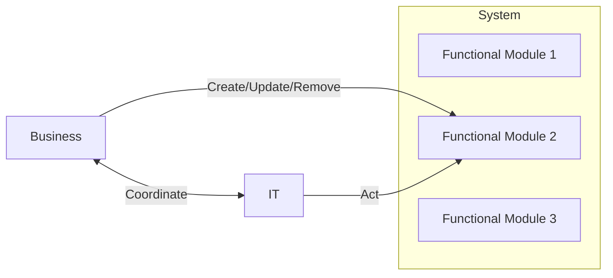
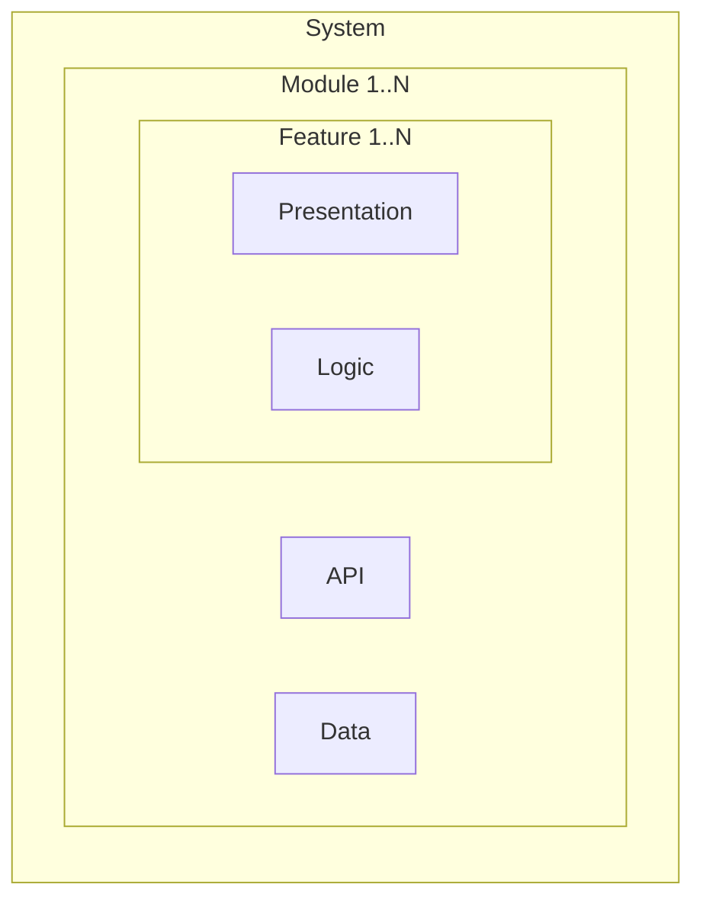
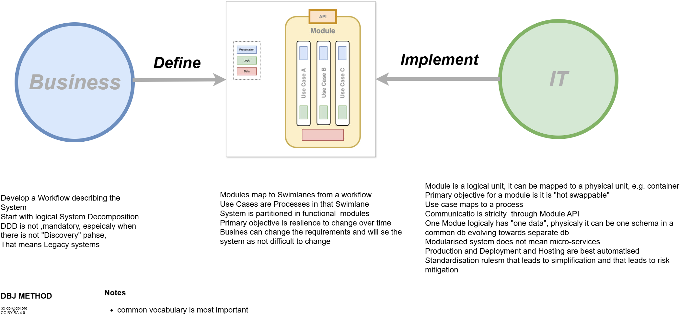
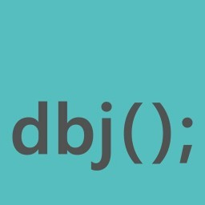

- [Primordial DBJ Method](#primordial-dbj-method)
  - [Overview](#overview)
  - [Core Concepts](#core-concepts)
    - [Workflow](#workflow)
    - [Workflow](#workflow-1)
    - [Modules and Features](#modules-and-features)
    - [Summary](#summary)
  - [Principles](#principles)
    - [1. Strict Separation of Concerns](#1-strict-separation-of-concerns)
    - [2. Module-Centric Design](#2-module-centric-design)
    - [3. Process Flow](#3-process-flow)
  - [Technical Requirements](#technical-requirements)
    - [Infrastructure (IT Responsibility)](#infrastructure-it-responsibility)
    - [Automation Requirements](#automation-requirements)
  - [Best Practices](#best-practices)
    - [Module Design](#module-design)
    - [Implementation Guidelines](#implementation-guidelines)
  - [Migration Strategy](#migration-strategy)

# Primordial DBJ Method

## Overview
DBJ Method is an enterprise architecture approach that enforces complete decoupling between Business and IT through functional modules of products.

## Core Concepts

### Workflow

- The whole macro process starts with business. 
- Business defines the system as set of functional modules
   - Module boundaries definition must be defined along the business logi lines
   - Workflow modelling visualises the system, modules and features existence
- One module is never final
   - Business can change the Module internals and signal the IT 
   - IT then develops the next version
- **System change** 
- non-trivial change, occurs when
   - Module is added
   - Module is removed
   - Module API changes
       - adding/removing a feature provokes Module API change
   - Feature is added or removed
   - Module Data is changed in any way
- trivial change, occurs when 
   - Feature in a module changes

### Workflow
 
(Arrows are action flow)

### Modules and Features

- Modules are composed of features.
- A feature is an atomic business capability or use case implemented inside a module.
- Features map to business processes steps and are the primary unit of change within a module.
- Adding/removing a feature may require API or data changes for the module (non-trivial change).
- Design features for minimal coupling so modules remain hot-swappable.

### Summary

## Principles

### 1. Strict Separation of Concerns
- Business defines functional requirements
- Functional Modules act as contracts
- IT implements Modules and develops the required infrastructure, that matches the implementation

### 2. Module-Centric Design
- Each module represents distinct business function
- Modules must be "hot swappable"
- Independent database schemas per module
- No cross-module dependencies

### 3. Process Flow
1. Business defines functional modules
2. Business Analysts and Architects validate
3. Only after full agreement, IT begins implementation

## Technical Requirements

### Infrastructure (IT Responsibility)
- Hosting environment preparation
- Deployment pipeline setup
- Runtime management system
- Monitoring and scaling solutions

### Automation Requirements
- Automated deployment processes
- Continuous integration/testing
- Version management
- Module-level monitoring
- Error handling and logging

## Best Practices

### Module Design
- Self-contained business functionality
- Independent database schemas
- Well-defined API contracts
- Standardized communication protocols
- Minimal shared dependencies

### Implementation Guidelines
- Favor composition over inheritance
- Use standardized communication patterns
- Implement comprehensive monitoring
- Maintain thorough documentation
- Plan for versioning and updates

## Migration Strategy
- Plan module boundaries carefully
- Implement gradual migration paths
- Maintain backward compatibility
- Document dependencies thoroughly
- Test swappability regularly

---

&copy; dbj dot org ltd | CC BY SA 4.0