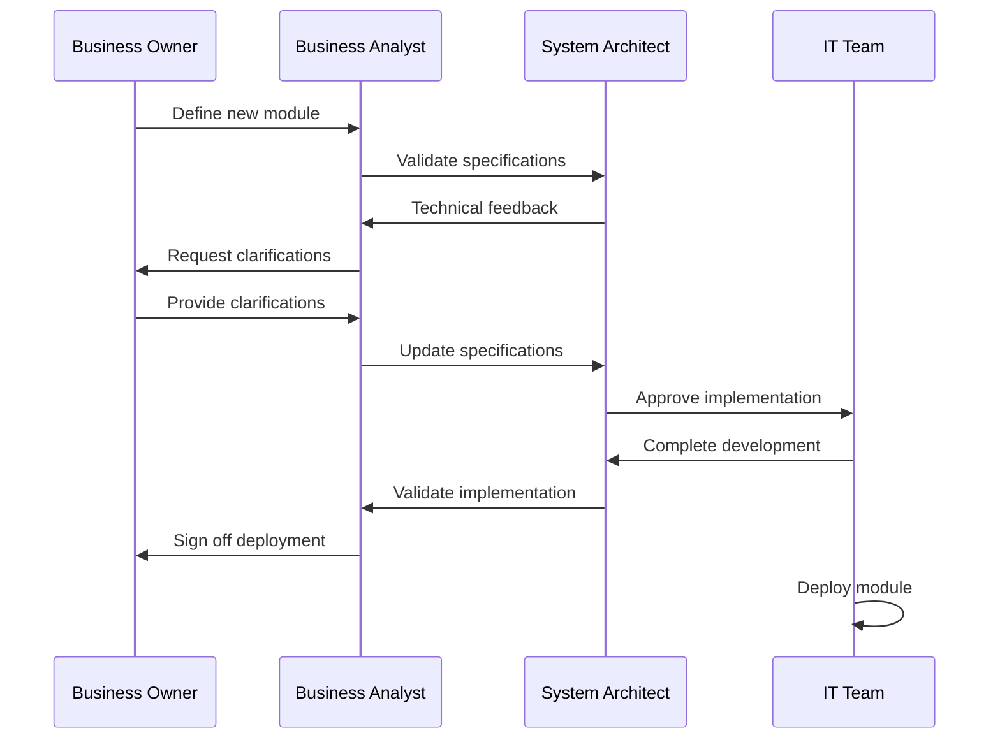
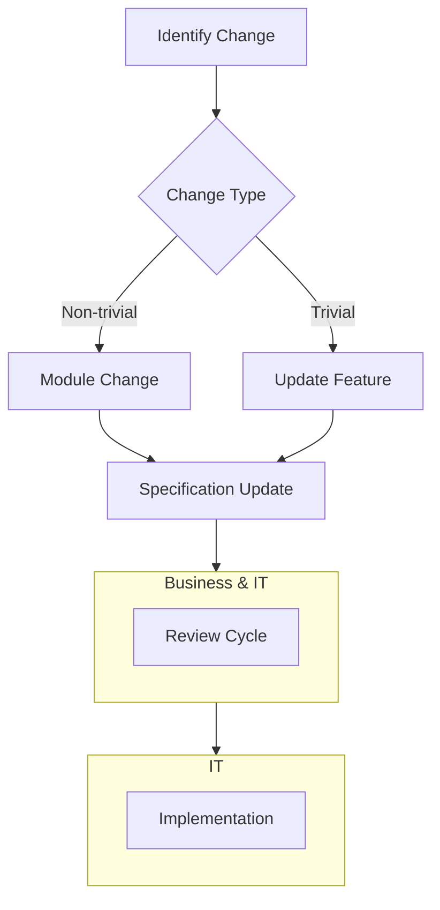

# Primordial DBJ Method Workflow

## Workflow Terminology

**Roles**

| Role | Responsibilities |
|------|-----------------|
| Business Owner | - Defines functional requirements - Sets module boundaries - Approves final specifications |
| Business Analyst | - Details requirements - Validates specifications - Coordinates between teams |
| System Architect | - Ensures technical feasibility - Reviews system integrity - Approves technical designs |
| IT Team | - Implements modules - Maintains systems - Handles deployments |

### Actions

#### Business Actions
- **Define**: Create new module specifications
- **Update**: Modify existing module features
- **Remove**: Deprecate and remove modules

#### Technical Actions
- **Validate**: Review and approve specifications
- **Implement**: Develop module features
- **Deploy**: Release to production environment

## Workflow Patterns

### Module Creation Flow

### Change Management

## Best Practices

1. **Clear Communication**
   - Common vocabulary
   - Document all decisions
   - Standardize and template
   - Maintain change logs

2. **Version Control**
   - Track specification versions
   - Document API changes
   - Maintain migration paths

3. **Quality Assurance**
   - Regular validation cycles
   - Automated testing
   - Performance monitoring

---

> &copy; dbj dot org ltd 
> 
> CC BY SA 4.0